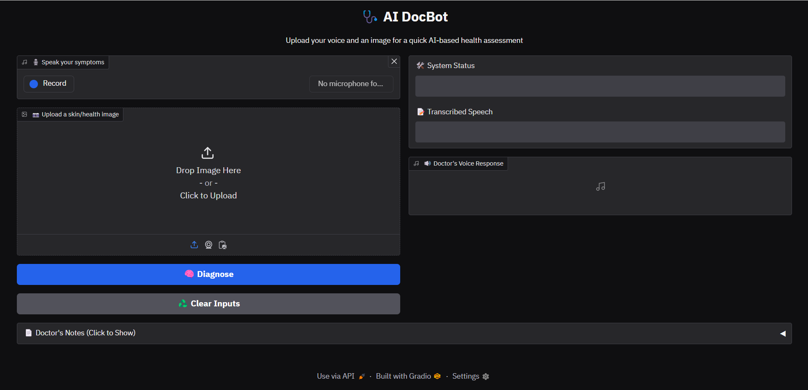

# 🩺 AI DocBot – Vision & Voice Powered Healthcare Assistant

**AI DocBot** is a voice-interactive virtual healthcare assistant powered by **LLMs, computer vision**, and **text-to-speech**. Patients can upload an image and speak about their symptoms, and the AI responds like a real doctor — with visual analysis, diagnosis, and vocal guidance.

> ⚠️ *For educational purposes only – Not a replacement for real medical advice.*

---

## 🚀 Features

- 🎤 **Speech-to-Text** with Whisper (`groq`)
- 🧠 **Medical Image Analysis** using `llama-3.2-11b-vision-preview`
- 🗣️ **Text-to-Speech** with [ElevenLabs](https://www.elevenlabs.io) or [gTTS](https://pypi.org/project/gTTS/)
- 📷 Upload any image of a skin problem, wound, or visible condition
- 🧾 Realistic medical advice in conversational tone
- 🤖 Clean, interactive UI with [Gradio](https://gradio.app/)

---

## 🧪 Demo

 <!-- optional screenshot -->

---

## 🛠️ Tech Stack

| Tech              | Purpose                                |
|-------------------|----------------------------------------|
| Python            | Core language                          |
| Gradio            | UI framework                           |
| Groq              | LLMs + Whisper API                     |
| ElevenLabs / gTTS | Text-to-speech voices                  |
| Pydub / FFMPEG    | Audio conversion and processing        |
| Dotenv            | Secret management                      |

---

## 🛠️ Installation

### 1️⃣ Clone the repository

```sh
git clone https://github.com/al-ghalib/AIDocBot.git
cd AIDocBot
```

### 2️⃣ Create a virtual environment (Optional but recommended)

```sh
python -m venv venv  # Windows: python -m venv venv
source venv/bin/activate  # Windows: venv\Scripts\activate
```

### 3️⃣ Install dependencies

```sh
pip install -r requirements.txt
```

### 4️⃣ Set up API keys

Create a `.env` file in the project root and add your **Google API Key and Groq API Key**:

```
GROQ_API_KEY=your_groq_api_key
ELEVENLABS_API_KEY=your_elevenlabs_api_key
```


## 🚦 Run Locally

```bash
python app.py
```

Visit [http://localhost:7860](http://localhost:7860)

---

## 🧠 Future Improvements

- 🤖 Use state-of-the art LLMs, especially for vision (Paid LLMs)
- 🧯 Fine-tune vision model on Medical Images
- 🩺 Store patient data with session tracking
- 🗂️ Add multi-image comparison
- 🌐 Add multilingual capabilities
- 🧬 Connect with actual health APIs (e.g. symptom checkers)
- 💬 Chat history with memory and summary

---

## 🤝 Contributing

Pull requests are welcome! For major changes, please open an issue first to discuss what you’d like to change or improve.

---

## 📄 License

MIT License – use freely with credit.

---

## 👨‍⚕️ Disclaimer

This application is intended for **learning and research** only. It does **not** provide real medical advice. For actual medical concerns, consult a licensed healthcare professional.

---

### Made with ❤️ by [Abdullah Al Ghalib](https://www.linkedin.com/in/abdullah-al-ghalib)

